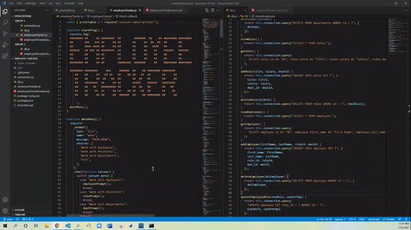

# Employee Tracker

- [Employee Tracker](#employee-tracker)
  - [Description](#description)
  - [Installation](#installation)
  - [Usage](#usage)
  - [Review Links](#review-links)
  - [Questions](#questions)
  - [Demo gif](#demo-gif)
  - [License](#license)

## Description
This application allows a company to manage their employee data.  They can add, update, and remove employees. They can also add or remove departments and positions within the company.

## Installation
For this application the user will need mySQL and a terminal.

## Usage
* First thing you need to do is run "npm i" in the terminal to install the packages needed to run this application
* After that you need to create the database and tables in mySQL using the employeeTrackerSeed.sql file.  
* When the database and tables are created you need create a .env file to load your mySQL password into the connection.js file(use the .env.EXAMPLE file for a reference)  
* Finally you can run "npm start" in the terminal to start the application.

## Review Links
[Repository](https://github.com/Twdavis85/Employee-Tracker) &nbsp; | &nbsp; 
[Demo](https://drive.google.com/file/d/14-gfBzc0jLuSdzVqswrYKGz_UYblwFUO/view?usp=sharing)

## Questions
To check out my work and follow me on GitHub visit: [Twdavis85](https://github.com/Twdavis85)  
If you have any questions about this or any other project feel free to email me at: [tdnc85@yahoo.com](mailto:tdnc85@yahoo.com)

## Demo gif

## License
Copyright 2021 &ensp; Tyler Davis

    Permission is hereby granted, free of charge, to any person obtaining
    a copy of this software and associated documentation files (the "Software"),
    to deal in the Software without restriction, including without limitation
    the rights to use, copy, modify, merge, publish, distribute, sublicense,
    and/or sell copies of the Software, and to permit persons to whom the
    Software is furnished to do so, subject to the following conditions:
    
    The above copyright notice and this permission notice shall be included
    in all copies or substantial portions of the Software.
    
    THE SOFTWARE IS PROVIDED "AS IS", WITHOUT WARRANTY OF ANY KIND, 
    EXPRESS OR IMPLIED, INCLUDING BUT NOT LIMITED TO THE WARRANTIES 
    OF MERCHANTABILITY, FITNESS FOR A PARTICULAR PURPOSE AND NONINFRINGEMENT. 
    IN NO EVENT SHALL THE AUTHORS OR COPYRIGHT HOLDERS BE LIABLE FOR ANY 
    CLAIM, DAMAGES OR OTHER LIABILITY, WHETHER IN AN ACTION OF CONTRACT, 
    TORT OR OTHERWISE, ARISING FROM, OUT OF OR IN CONNECTION WITH THE SOFTWARE 
    OR THE USE OR OTHER DEALINGS IN THE SOFTWARE.